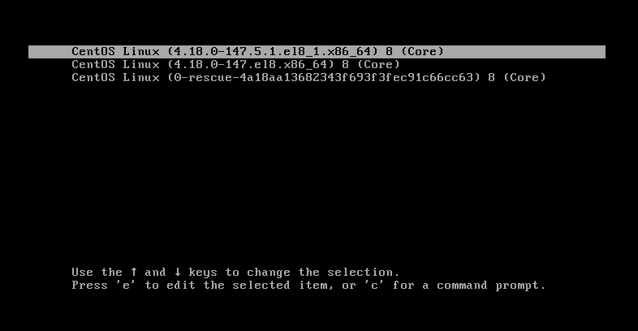
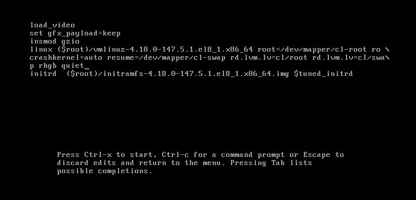
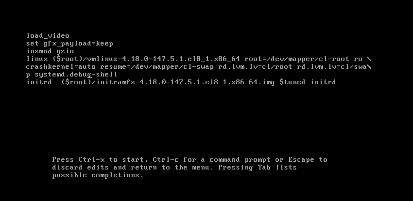
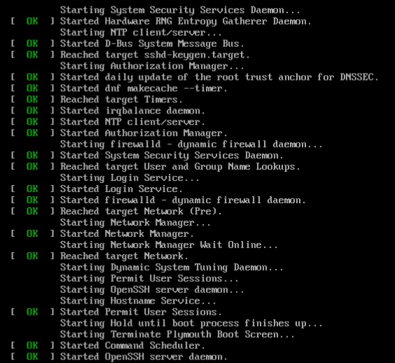
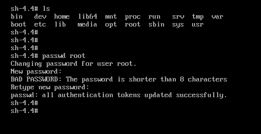

## Centos Root Password Recovery

### Introduction
Did you forget your centos root password before ?
if you didn't then let me tell you that you didn't use centos for alot..
really you have to forget passwords some times, that's not optional, i'm telling you, YOU WILL!

### Problem
losing Centos password.

### Solution

Recovering password using grub to pass linux kernel parameter on boot.

* Stop Grub Countdown Timer (ESC)
First turn on the centos machine and press (ESC) keyboard key or use arrows keys to stop the grub boot loader countdown timer

* Edit Kernel Entry (E)
Then we need to edit the first entry in grub, to edit the entry you have to press (e) key on the keyboard.

* Added `systemd.debug-shell` instead of `rhgn quiet`
You can see the linux boot parameters which ended by `rhgb quiet` if those 2 parameters are not there then every thing is ok just go to the end of the line which starts with `linux` word, then we need to delete those 2 words if exists and also add `systemd.debug-shell` to the end of the line.

* Boot from custom entry (Ctrl+X)
That will make us able to use debug shell when we don't have root or any user access to the machine.
So to boot in the machine now we have to press (ctrl+x) on the keyboard.

* Opening Debug Shell (Ctrl+Alt+F9)
After the linux boot we need to go to the debug shell which we enabled from the boot loader , press (ctrl+alt+f9) on the keybaord to do so, if you are using virtualbox then read this [section](virtualBoxSoftKeyboard) about how to press do special keys on virtualbox

* Reset Root Password (`passwd root`)
Now we can reset the password of the root account using `passwd` command, we can specify the account name as parameter to the command so it will be `passwd root`.

## END
[back to home](/Centos/)
