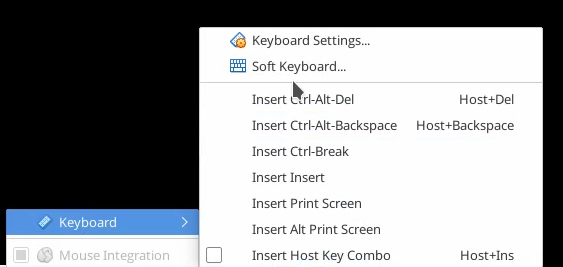
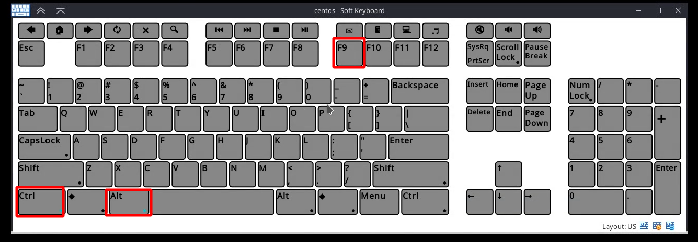

## Virtualbox Soft Keyboard

Oracle VM VirtualBox provides a soft keyboard that enables you to input keyboard characters on the guest. A soft keyboard is an on-screen keyboard that can be used as an alternative to a physical keyboard.

### How to open Soft Keyboard
from Input -> Keyboard -> Softkeys.

### Using it to press multiple keyboard keys in the same time
Just press on the meta keys (Ctrl,Alt,Shift,..) before others (Numbers,Letters,F1-12,Prt-Sc)

## END
[back to home](/Centos/)
